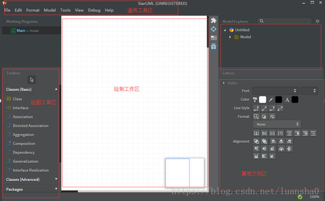

在系统设计中，常常需要对产品人员和研发人员以及测试人员等描述系统设计，最好的方式就是使用UML图，能够直观的表现系统，现将Mac下安装StarUML 以及学见的UML图进行简要说明。
## 1、StarUML安装
StarUML(简称SU)，是一种创建UML类图，生成类图和其他类型的统一建模语言(UML)图表的工具。StarUML是一个开源项目之一发展快、灵活、可扩展性强(zj).

StarUML官方下载地址： http://staruml.io/download

安装教程： 
安装步骤很简单，省略。 
注意：付费软件，如需破解网上很多教程，本人叁考以下地址破解成功：
https://www.jianshu.com/p/53197ac82dc6
安装之后的主界面简介如图所示：<b>
